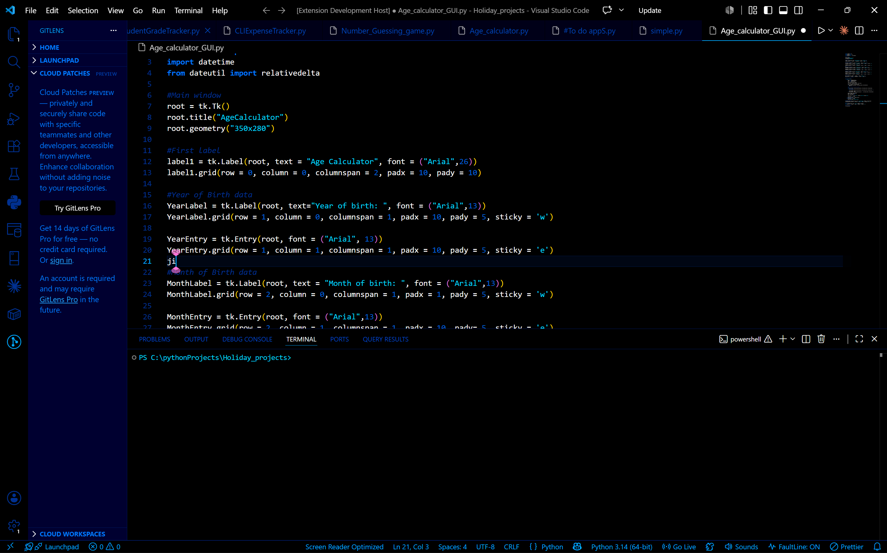

# Bleupers Blue

A sleek, ultra-dark code canvas engineered for high-focus midnight development sessions. **Bleupers Blue** drops the traditional muddy grays and stark text colors, plunging your editor into a pitch-black layout accented by sharp, electric sapphires, cyans, and deep lapis tones.

## Features

*   **True Pitch-Black Canvas:** `#000000` main editor background optimizes contrast and maximizes visual breathing room for your code.
*   **Electric Sapphire Identity:** Integrated UI accents using a curated neon-electric blue palette.
*   **Toned-Down Sidebar:** Subdued folder tree and file explorers to keep your attention strictly on the active file.
*   **Stealth Line Highlighter:** A translucent tech-blue line indicator that highlights your current line without drowning out syntax elements.

## Preview

## Syntax Highlights

*   **Keywords & Control Flow:** Sharp, bold electric blue (`#0078ff`)
*   **Strings & CSS Values:** Crisp, glowing cyber cyan (`#00d8ff`)
*   **Functions & Methods:** Clean sapphire blue (`#00a8ff`)
*   **Variables & Operators:** Stark, readable off-white (`#ffffff`)
*   **Comments:** Muted, low-contrast deep navy (`#003090`)

## Installation

1. Open **Visual Studio Code**
2. Launch the Extension Marketplace (`Ctrl+Shift+X` or `Cmd+Shift+X`)
3. Search for `Bleupers Blue`
4. Click **Install**, then select it as your active color theme.

---
**Enjoying Bleupers Blue?** Feel free to leave a review or check out its sibling theme, *Midnight Pink*!
